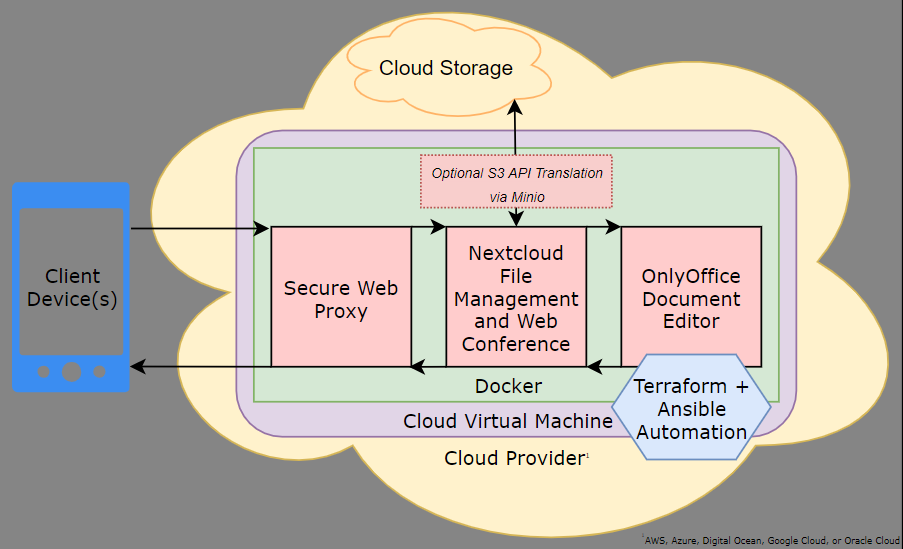

# Overview
Nextcloud built in the cloud automatically using Terraform with Ansible.

Available for AWS, Azure, Digital Ocean, GCP (Google), and OCI (Oracle) - plus standalone deployment options.

# Instructions
Several deployment options are available, see the README of each subdirectory for platform-specific guides. For standalone deployments, see the playbooks/ directory.

# Videos
Cloud deployments:
- [Prerequisites](https://youtu.be/SJ0hrXPbMNo) - Watch this first if deploying in the cloud.
- [AWS](https://youtu.be/Y1kUaYYDMvc)
- [Azure](https://youtu.be/xS80EdVuJhU)
- [DigitalOcean](https://youtu.be/Npgenw8It6c)
- [Google Cloud](https://youtu.be/Sr3kA9GJrU0)
- [Oracle Cloud](https://youtu.be/5Qaj6E2_mIY)

# Discussion
[Discord Room](https://discord.gg/zmu6GVnPnj)
